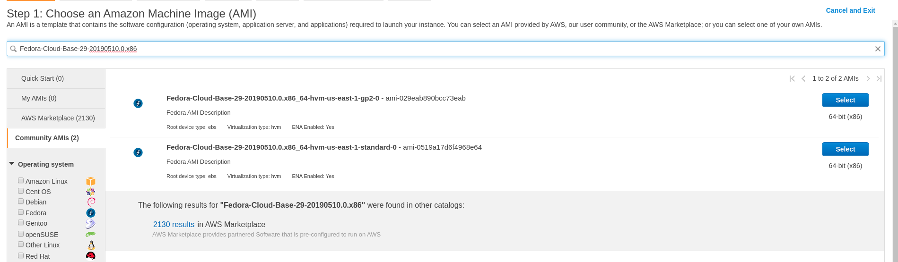
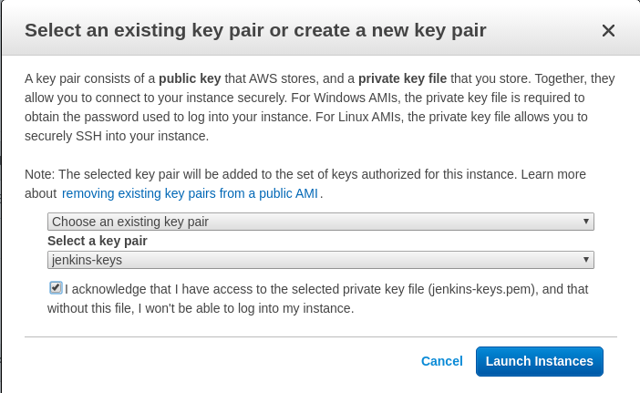
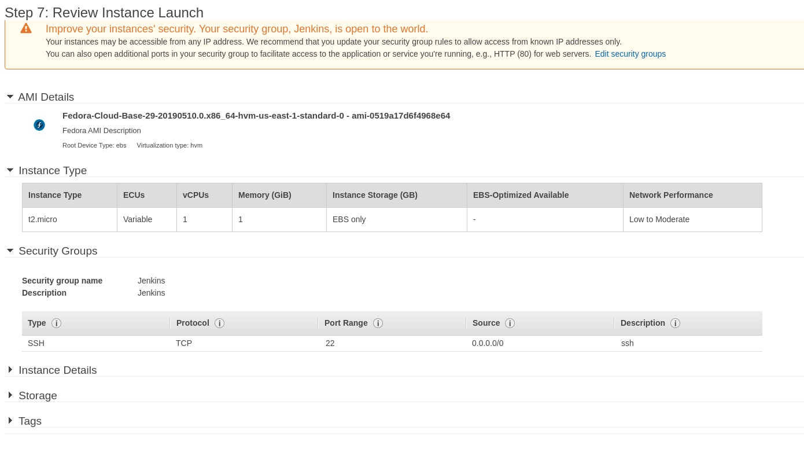
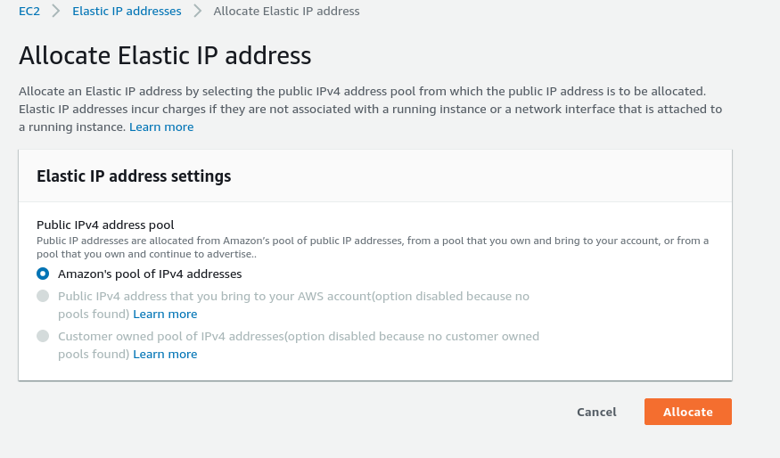
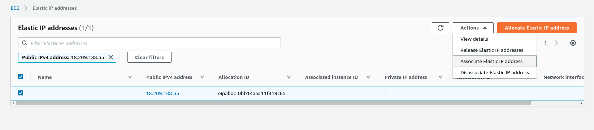
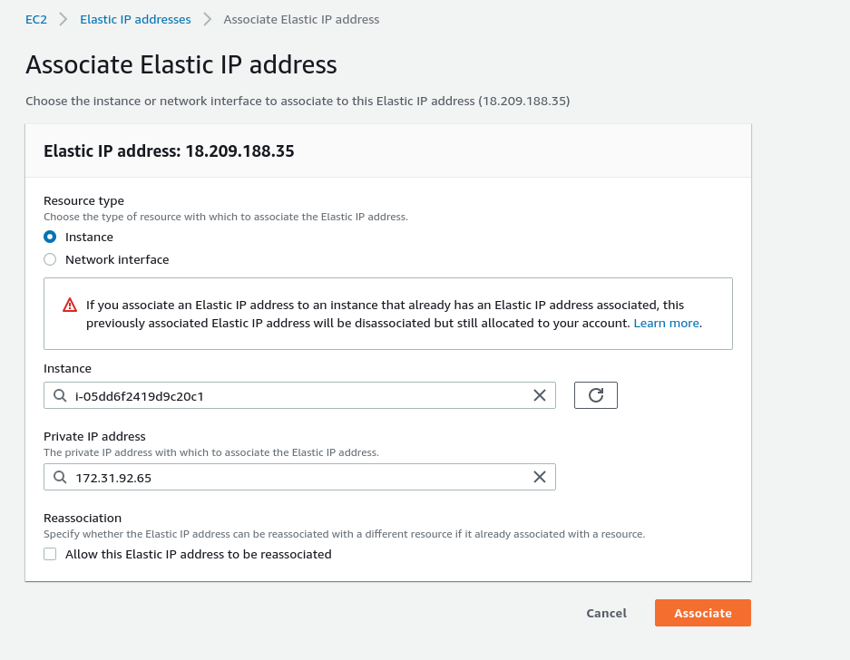
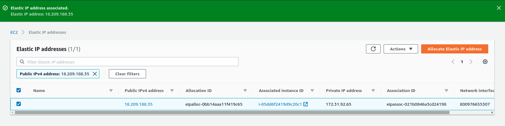
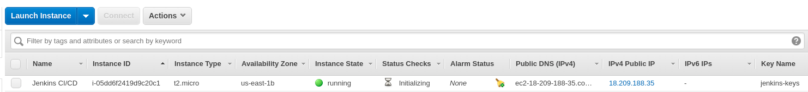

# AWS AMAZON
A continuación se va a explicar los pasos necesarios para crear una instancia AWS Amazon para la instalación de nuestro servidor Jenkins.

En este caso hemos creado nuestra máquina en `AWS EDUCATE` pero se puede crear con una cuenta en estas dos páginas:  
+ https://aws.amazon.com/es/
+ https://www.awseducate.com/

## Pasos
+ Crear instancia:  
`Launch Instance - Launch Instance`
  

+ Elegir máquina con el sistema operativo que queramos:  
`Community AMMIs - Fedora-Cloud-Base-29-20190510.0.x86_64-hvm-us-east-1-standard-0 (ami-0519a17d6f4968e64)`
  
> El ejemplo es creado con una instancia de Fedora29

+ Elegir par de claves para conectarnos por SSH a la instancia:  
  
> Si no se tiene, ir al menú principal y elegir el apartado de crear nuevo par de claves para usarlas en este paso.  

+ Los siguientes pasos será darle a continuar. Cuando llegamos al `Step 7` podemos modificar algunos detalles de la instancia. En este caso, crearemos un `security group` propio para Jenkins con de momento solo el puerto `SSH 22` abierto:  
  

+ Para finalizar, daremos a `launch instance` y ya estará creada.

## Creación IP estática
Éste es un paso de pago en Amazon. No obstante, crearemos esta IP estática para que nuestra máquina siempre tenga la misma IP. Con ésto nos permitirá que, aunque apaguemos nuestra máquina, al encenderla seguirá con la misma IP y no se cambiará por otra:

+ En el menú principal iremos a:  
`Network & Security - Elastic IPs`
  

+ Clicaremos en `Allocate Elastic IP address`:  
  

+ A continuación elegiremos la opción `Amazon's pool of IPv4 addresses` para que nos pueda dar una IP reservada y única para nuestra máquina:  
  

+ Ahora nos aparece una `IP pública` para nosotros. Lo que haremos ahora será asociarla a nuestra instancia creada para Jenkins:  
`Seleccionamos la IP - Actions - Associate Elastic IP address`  
  
  

+ Seleccionamos `Instance` y en el buscador elegimos la que tendremos creada. En el otro buscador de `Private IP address` en cuanto entremos entro nos saldrá directa la opción de la IP privada que tiene nuestra instancia. Y clicamos en `Associate`:  
  

+ Ya tendremos la IP elástica asociada a nuestra máquina:  
  
  

__NOTA__: Cuando instalemos Jenkins en nuestra instancia tendremos que abrir el _puerto por defecto 8080_ en el security group y si luego cambiamos de puerto (en nuestro caso será el _9090_), tendremos que indicar el puerto que escuchará para Jenkins:  
  
