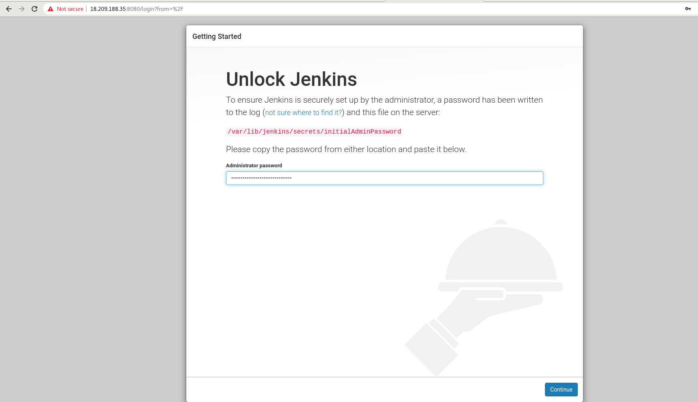
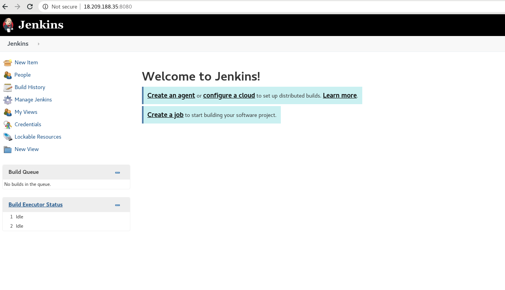

# CONFIGURACIÓN
Una vez instalado Jenkins en nuestra instancia de AWS Amazon seguiremos con la finalización de instalación y configuración en la interfaz de Jenkins.  

Como se ha indicado antes, trabaja en el puerto 8080 pero podemos comprobarlo en que puerto se escucha con la siguiente orden:
`[fedora@ip-172-31-92-65 ~]$ netstat -putan`  
```
[fedora@ip-172-31-92-65 ~]$ netstat -putan
(Not all processes could be identified, non-owned process info
 will not be shown, you would have to be root to see it all.)
Active Internet connections (servers and established)
Proto Recv-Q Send-Q Local Address           Foreign Address         State       PID/Program name    
tcp        0      0 0.0.0.0:22              0.0.0.0:*               LISTEN      -                   
tcp        0    628 172.31.92.65:22         90.168.170.12:46052     ESTABLISHED -                   
tcp6       0      0 :::22                   :::*                    LISTEN      -                   
**tcp6       0      0 :::8080                 :::*                    LISTEN      -                   
udp        0      0 0.0.0.0:68              0.0.0.0:*                           -                   
udp        0      0 0.0.0.0:68              0.0.0.0:*                           -                   
udp        0      0 127.0.0.1:323           0.0.0.0:*                           -                   
udp6       0      0 ::1:323                 :::*                                -                   
```
> Con el ** se indica cual es el puerto de Jenkins.

Vamos al navegador y ponemos nuestra IP pública de Amazon junto el puerto 8080:  
`http://18.209.188.35:8080/`

La primera vez que entramos, nos pide crear un usuario administrador, y nos indica que en el fichero `/var/lib/jenkins/secrets/initialAdminPassword` está el `administrator password` para tener las credenciales y seguir el proceso de configuración:  
`[fedora@ip-172-31-92-65 ~]$ sudo cat /var/lib/jenkins/secrets/initialAdminPassword`
  
  
> Esto se hace para que cualquier persona no pueda entrar aquí y iniciar su instalación y configuración de Jenkins.  

Después, en el siguiente paso nos indica de instalar los plugins sugeridos o personalizar los plugins que queremos. En este caso instalaremos los sugeridos:  
  
  


Una vez instalado, nos pedirá de crearnos un primer usuario administrador. Creamos el usuario y ya tendremos todo instalado y hecha la configuración inicial:  
  
  
  

Si vamos a `Manage Jenkins - Configure System` vemos que el directorio donde trabaja es `/var/lib/jenkins`:  
  

Por último vamos a cambiar el puerto por defecto(8080) para prevenir a que otras aplicaciones puedan utilizar también este puerto. Lo cambiaremos por el puerto `9090`.   

Para ello iremos al fichero de jenkins `etc/sysconfig/jenkins` y cambiaremos la parte de `--httpPort=8080` y lo reemplazamos por el `9090`:  
`[fedora@ip-172-31-92-65 sysconfig]$ sudo vim /etc/sysconfig/jenkins`  
```
JENKINS_PORT="9090"
```
  
  


Después de esto, cambiaremos el __security group de AWS__ y pondremos el nuevo puerto de __9090__ para que escuche Jenkins.
  

Finalmente, reiniciamos el servicio Jenkins y ya estará por ahora todo instalado y configurado completamente:  
`[fedora@ip-172-31-92-65 ~]$ sudo systemctl restart jenkins`  
