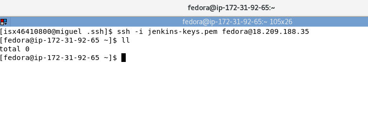
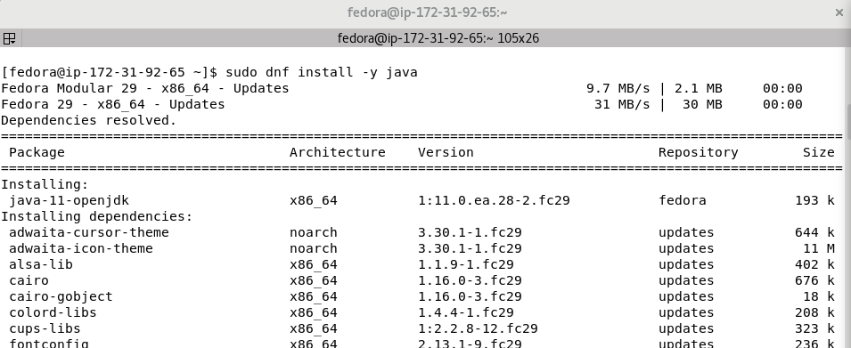
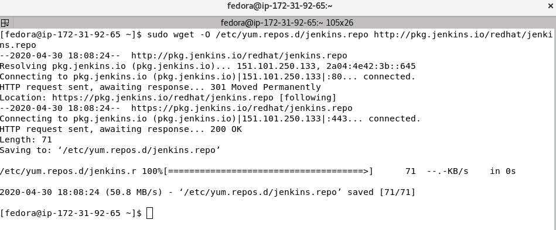
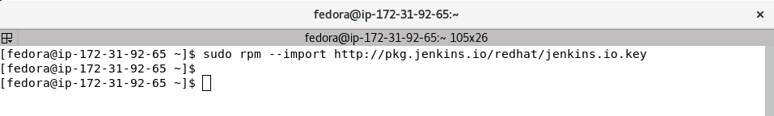
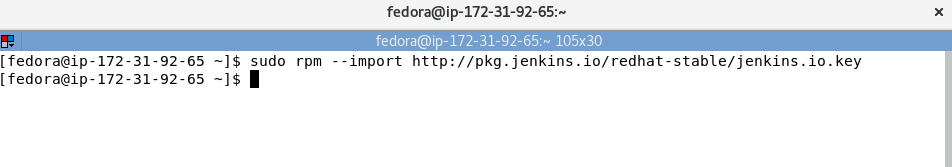
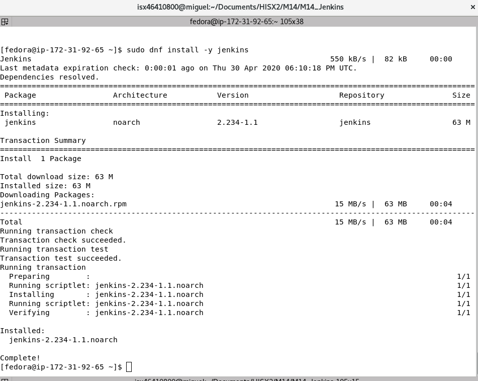
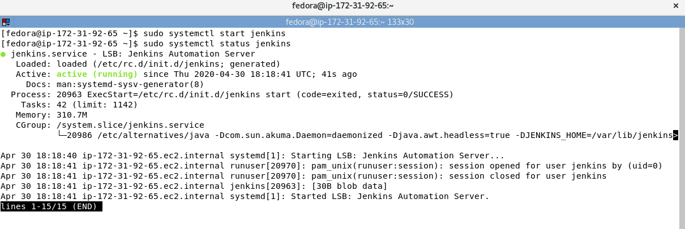

# INSTALACIÓN JENKINS

Jenkins es un servidor de automatización multiplataforma, es decir, puede utilizarse en diversos entornos o sistemas operativos.

Se puede descargar desde su página oficial en el siguiente enlace: [descargar Jenkins](https://jenkins.io/download/)

Como está basado en Java el requisito previo es tenerlo instalado en nuestra máquina. Jenkins recomienda las siguientes características de hardware para su instalación:
```
Minimum hardware requirements:
256 MB of RAM
1 GB of drive space (although 10 GB is a recommended minimum if running Jenkins as a Docker container)

Recommended hardware configuration for a small team:
1 GB+ of RAM
50 GB+ of drive space

Comprehensive hardware recommendations:
Hardware: see the Hardware Recommendations page

Software requirements:
Java: see the Java Requirements page
Web browser: see the Web Browser Compatibility page
```

A continuación vamos a indicar los pasos para la instalación en sistemas operativos basados en Red Hat/Fedora/CentOS y en Ubuntu/Debian.

## RED HAT/FEDORA/CENTOS  
Primero empezaremos con Red Hat/Fedora/CentOS, ya que es mi elección para este proyecto. Mi instalación será realizada en una instancia AWS de Amazon con Fedora 29:

+ Nos conectamos por _SSH_ a nuestra máquina en Amazon desde el directorio _~/.ssh/_:  
`ssh -i jenkins-keys.pem fedora@18.209.188.35`  


+ Actualizar repositorios:  
`sudo dnf update -y`  

+ Instalar _Java_:  
`sudo dnf install -y java`  
  

+ Agregar repositorios de _Jenkins_:  
`sudo wget -O /etc/yum.repos.d/jenkins.repo http://pkg.jenkins.io/redhat/jenkins.repo`  
`sudo rpm --import http://pkg.jenkins.io/redhat/jenkins.io.key`  
`sudo rpm --import http://pkg.jenkins.io/redhat-stable/jenkins.io.key`  
  
  
  

+ Instalar __Jenkins__:  
`sudo dnf install -y jenkins`  
  

+ Encender el servicio _Jenkins_:  
`sudo systemctl start jenkins`  
`sudo systemctl status jenkins`  
  

## UBUNTU/DEBIAN  
Para los sistemas Ubuntu/Debian seguiremos los siguientes pasos:  
+ Actualizar repositorios:  
sudo apt update

+ Instalar _Java_:  
sudo apt install openjdk-8-jdk

+ Agregar repositorios de _Jenkins_:  
wget -q -O - https://pkg.jenkins.io/debian/jenkins.io.key | sudo apt-key add -
sudo sh -c 'echo deb http://pkg.jenkins.io/debian-stable binary/ > /etc/apt/sources.list.d/jenkins.list'

+ Instalar __Jenkins__:  
sudo apt update
sudo apt install jenkins

+ Encender el servicio _Jenkins_:  
sudo systemctl start jenkins
sudo systemctl start jenkins

## NOTAS A TENER EN CUENTA  
+ Al instalar se crea el usuario y grupo `Jenkins`  
+ Jenkins trabaja en el directorio `/var/lib/jenkins`  
+ Los archivos de log están en `/var/log/jenkins/jenkins.log`  
+ Los parametros de configuración se encuentran en `/etc/sysconfig/jenkins`  
+ Por defecto, el puerto donde trabaja Jenkins es el `8080`
