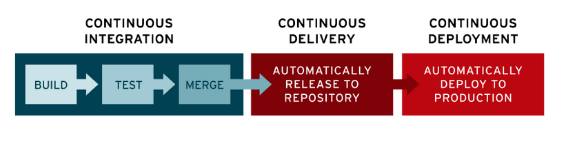
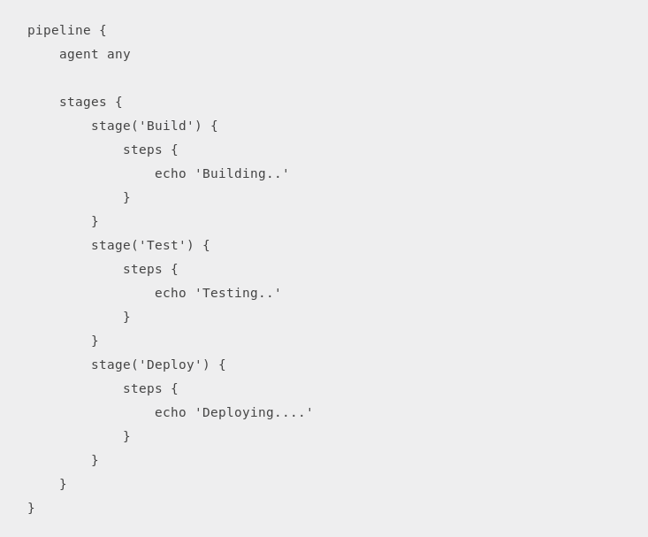

# <u>__CI/CD JENKINS__</u>  
  

## **Índice**
1. [¿Qué es CI/CD?](#id1)   
    1.1. [Objetivos de cada etapa](#id11)  
    1.2. [Metodología Ágile](#id12)
2. [Jenkins](#id2)  
    2.1. [Características](#id21)  
    2.2. [Pipelines](#id22)  
    2.3. [Jobs](#id23)  
    2.4. [Jenkinsfile](#id24)  
    2.5. [Plugins](#id25)  
3. [Ejercicios prácticos](#id3)  
    3.1. [Ejemplo 01](#id31)  
    3.2. [Ejemplo 02](#id32)  
    3.3. [Ejemplo 03](#id33)  
    3.4. [Ejemplo 04](#id34)  
    3.5. [Ejemplo 05](#id35)  
    3.6. [Ejemplo 06](#id36)  

# __1. ¿Qué es CI/CD?__  
Las siglas CI/CD se refiere al término de Continuous Integration / Continuous Deployment o Continuous Delivery.  
La CI/CD es un método para distribuir aplicaciones a los clientes con frecuencia mediante el uso de la automatización en las etapas del desarrollo de aplicaciones. Los principales conceptos que se atribuyen a la CI/CD son la integración continua, la distribución continua y la implementación continua.  

  

<u>Ejemplos:</u>  
+ Jenkins
+ Gitlab  
+ TeamCity  
+ Travis CI
+ Buddy  
+ Puppet Enterprise  
+ ...

## __1.1. Objetivos de cada etapa__  
**CI(Continuous Integration):** El objetivo del desarrollo de las aplicaciones modernas es contar con múltiples desarrolladores que trabajen de forma simultánea en distintas funciones de la misma aplicación. ayuda a que los desarrolladores fusionen los cambios que introducen en el código para incorporarlos a una división compartida (o "rama") con más frecuencia, incluso diariamente.  
Esto significa probar todo, desde las clases y el funcionamiento hasta los distintos módulos que conforman toda la aplicación. Si una prueba automática detecta un conflicto entre el código nuevo y el actual, la CI facilita la resolución de esos errores con frecuencia y rapidez.

**CD(Continuous Delivery):** El objetivo de la distribución continua es tener una base de código que pueda implementarse en un entorno de producción en cualquier momento.  
En la distribución continua, cada etapa (desde la fusión de los cambios en el código hasta la distribución de los diseños listos para la producción) implica la automatización de las pruebas y de la liberación de código. Al final de este proceso, el equipo de operaciones puede implementar una aplicación para que llegue a la etapa de producción de forma rápida y sencilla.  

**CD(Continuous Deployment):** La última etapa de la canalización consolidada de integración y distribución continuas es la implementación continua, que automatiza el lanzamiento de una aplicación a la producción, ya que es una extensión de la distribución continua, la cual automatiza el lanzamiento de una compilación lista para la producción a un repositorio del código. Debido a que no hay una entrada manual en la etapa del canal anterior a la producción, la implementación continua depende, en gran medida, del correcto diseño de la automatización de pruebas.  
En la práctica, la implementación continua implica que el cambio implementado por un desarrollador en una aplicación pueda ponerse en marcha unos cuantos minutos después de escribirlo.

  

## __1.2. Metodología Ágile__  
Es uno de los tipos que existen como Ciclo de Vida de Desarrollo de Software.

Tiene como principio la necesidad de brindar al cliente resultados rápidos de la evolución en el proceso de creación de software, buscando conseguir la mayor satisfacción posible y una gran adaptabilidad del producto.  

Como he comentado en la explicación anterior del CI/CD, este gráfico circular corresponde a toda la fase de integración, desarrollo e implementación del software o aplicación. Cada fase pasa a una, siendo testeada para encontrar fallos o continuar con el proceso hasta llegar finalmente a la entrega del cliente. Al estar todo automatizado, nos indicará si en alguna fase hay fallos para poder corregirlos o ver directamente que la entrega a un cliente o deployment no tendría ningún fallo.  

  

Las ventajas de esta metodología, pueden destacarse cinco:  

+ **Adaptabilidad:** a diferencia de los modelos tradicionales, para los cuales toda la planificación se lleva a cabo en el inicio, el Desarrollo Ágil restringe la planificación a la creación de cada funcionalidad. De esta manera, puede adaptarse dinámicamente a los cambios en los requerimientos del cliente.
+ **Entrega rápida de software funcional:** dado que el sistema se centra en el desarrollo de funciones por separado, permite contar rápidamente con demostraciones del producto que notifiquen al cliente del avance del proceso.
+ **Poca o nula planificación:** la etapa de planeamiento que tiene lugar en cada ciclo iterativo es muy reducida en comparación con la gran planificación de los modelos de tipo “cascada”.
+ **Flexibilidad para los desarrolladores:** dado que se reduce significativamente el proceso de planeamiento y documentación, el trabajo de los programadores no se restringe sólo a seguir lineamientos preestablecidos.
+ **Promueve el trabajo en equipo y la capacitación:** puesto que distintos grupos de trabajo se dedican a desarrollar diferentes funcionalidades, la comunicación entre ellos es vital.

En resumen, el Desarrollo de Software Ágil es una metodología que emplea mínimos recursos y es particularmente útil para proyectos cambiantes.  

# __2. Jenkins__  
Jenkins es, por definición, un servidor open source de integración continua (CI). Es el software de automatización más usado de todos, escrito en Java. Es muy conveniente al contar con más de 14.000 plugins para soportar la automatización de todo tipo de tareas.  

Fue originalmente desarrollado con el nombre Hudson. El desarrollo de Hudson empezó en el verano de 2004 en Sun Microsystems. El 7 de julio de 2016 se hizo pública la primera versión 2.x0 con soporte LTS.  

Jenkins es nuestro inspector, es como esa persona que revisa que todo esté en perfectas condiciones antes de ser enviado a producción, puede hacer cosas por nosotros al momento de que detecte cambios en nuestro código, podemos decirle haga deploy si todo está correcto y nos mande una notificación a slack si algo falla.  

  

## __2.1. Características__  
Algunas de las tareas más habituales que Jenkins es capaz de hacer son las siguientes:  
+ Testar el software.
+ Revisar las métricas de calidad del software establecidas por el equipo de trabajo.
+ Enviar las modificaciones del software, una vez pasadas todas las validaciones, al repositorio principal.
+ Automatizar la compilación del software o su despliegue, una vez se hayan integrado nuevos cambios en el proyecto.
+ Notificar debidamente a los desarrolladores o al equipo de aseguramiento de la calidad cuando se encuentra cualquier tipo de error, ya sea en base a las pruebas del software o a las métricas de calidad definidas.
+ Generar o visualizar la documentación de un proyecto

## __2.2. Pipelines__  
Un pipeline CI/CD es un conjunto de prácticas para incorporar la automatización continua y el control permanente en todo el ciclo de vida. Desde las etapas de integración y prueba, hasta las de distribución e implementación en el entorno elegido.  

  

Las características fundamentales de un pipeline CI/CD son:  

+ __Integración y verificación:__ en un workflow de desarrollo de software típico, se espera que varios desarrolladores desarrollen en sus propias ramas. Estas se van integrando periódicamente en una rama de desarrollo común. Cuando se integra un nuevo código, o incluso antes de que se integre, es esencial verificar. Con ello podrás garantizar rápidamente que la integración no entra en conflicto con las funcionalidades existentes.
+ __Automatización:__ para lograr velocidad, es esencial que la verificación esté automatizada. Es decir, debería estar compuesto por una serie de pruebas automatizadas y revisión de la seguridad del desarrollo de forma continua. La automatización reduce el tiempo que los desarrolladores dedican a las tareas rutinarias y elimina los tiempos de espera en etapas de desarrollo.
+ __Cultura DevOps:__ tu equipo de desarrollo tiene un gran papel que desempeñar para garantizar la continuidad del pipeline. Puede detectar y solucionar errores con anticipación, antes de que se conviertan en problemas mayores. Podrán responder de inmediato a cambios más pequeños y generar pruebas con más frecuencia.
+ __Contenedores:__ no es obligatorio, pero si la implementación se basa en contenedores como Docker, reducirás la complejidad de la infraestructura. Además de estandarizar el sistema donde trabajará la aplicación.

## __2.3. Jobs__  
La base de Jenkins son las tareas Jobs, desde donde podrás indicar todo el proceso hasta llegar a un build final estable.  

Cada integración se verifica compilando el código fuente y obteniendo un ejecutable (a esto se le llama build, y debe hacerse de forma automatizada).Además también se pasan las pruebas y métricas de calidad para detectar los errores tan pronto como sea posible.  

  

Es muy recomendable hacer builds periódicamente y comprobar que funcionen correctamente, para conseguir un producto final más fiable, con menos fallos en producción.  

Al integrar frecuentemente el código, y con la ayuda de herramientas como Jenkins, puedes saber el estado del software en todo momento. Sabes qué funciona, qué no y qué errores hay.  

## __2.4. Jenkinsfile__  
El pipeline del proyecto se declara en un fichero, se almacena y se versiona junto con el código en un fichero comúnmente llamado Jenkinsfile. En este fichero definimos principalmente las fases (stages) de que las consta nuestro flujo.  

A parte de las fases mencionadas anteriormente podemos añadir cualquier código que necesitemos como funciones, parámetros, configuraciones...  

  

La creación de un Jenkinsfile y su subida al repositorio de control de versiones, otorga una serie de inmediatos beneficios:  
+ Crear automáticamente un pipeline de todo el proceso de construcción para todas las ramas y todos los pull request.
+ Revisión del código en el ciclo del pipeline.
+ Auditar todos los pasos a seguir en el pipeline
+ Una sencilla y fiable fuente única, que puede ser vista y editada por varios miembros del proyecto.

## __2.5. Plugins__  
Un plugin es un fragmento o componente de código hecho para amplicar las funciones de una herramienta o de un programa.  

  

Jenkins puede extenderse mediante plugins . Actualmente hay una gran cantidad de plugins que permiten cambiar su comportamiento o añadir nuevas funcionalidades. Entre los más utilizados se encuentran:

+ **Javadoc:** Este plugin añade soporte Javadoc a Jenkins. Esta funcionalidad solía ser una parte del núcleo, pero a partir de Jenkins 1.431, se separó en diferentes plugins.
+ **Mailer:**  Permite configurar las notificaciones de correo electrónico con los resultados de los builds. Para ello es necesario configurar el servidor de correo.
+ **External-monitor-job:** Añade la posibilidad de controlar el resultado de los trabajos realizados externamente.
+ **Credentials:** Este plugin permite almacenar credenciales. Proporciona una API estándar para otros plugins para almacenar y recuperar diferentes tipos de credenciales.
+ **Ssh-slaves:** Este plugin le permite administrar los esclavos que se ejecutan en máquinas * nix a través de SSH. Añade un nuevo tipo de método de lanzamiento de esclavos.

# __3. Ejercicios prácticos__  
Para llevar a cabo una mejor compresión del funcionamiento de Jenkins, se ha realizado una serie de ejercicios prácticos.

## __3.1. Ejercicio 1__

## __3.2. Ejercicio 2__

## __3.3. Ejercicio 3__

## __3.4. Ejercicio 4__

## __3.5. Ejercicio 5__

## __3.6. Ejercicio 6__
