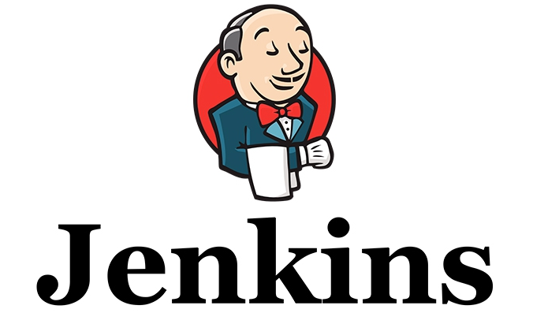
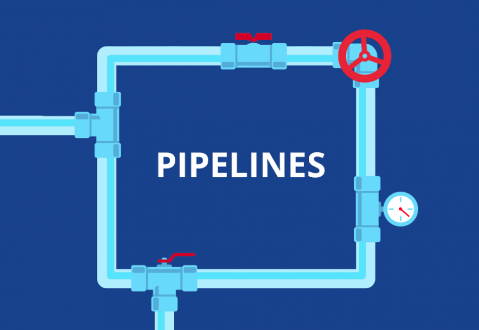
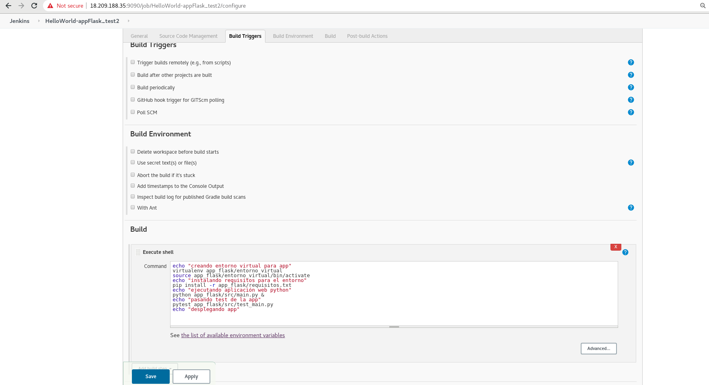
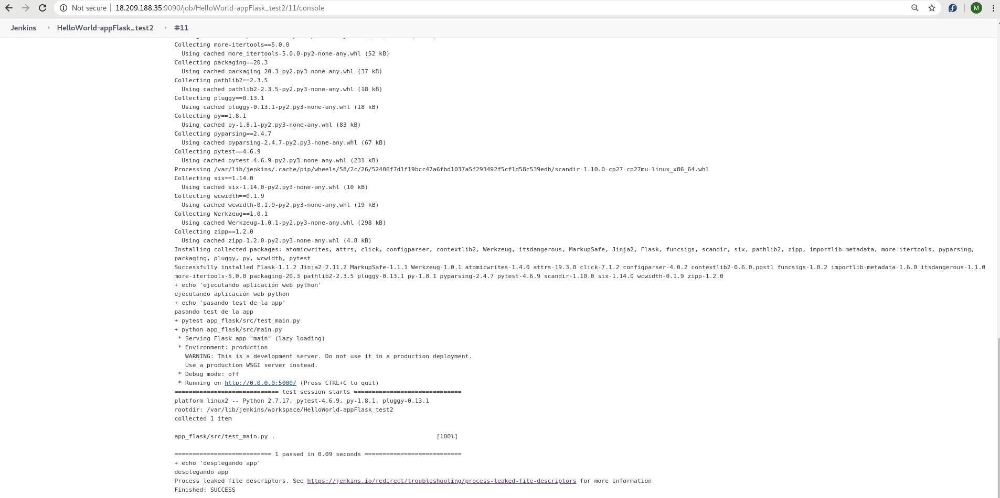
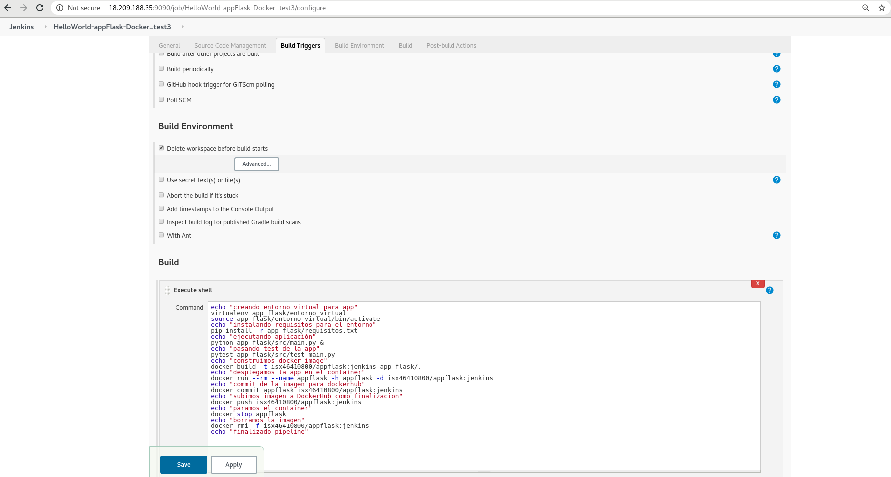
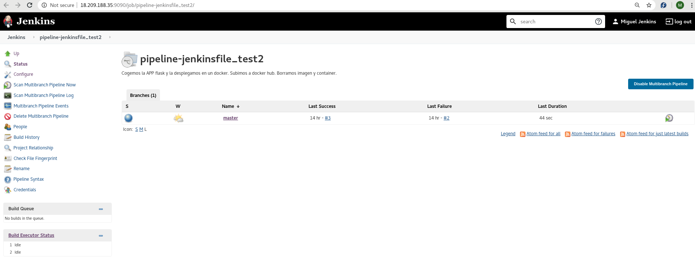

# <u>__CI/CD JENKINS__</u>  
  

## **Índice**
1. [¿Qué es CI/CD?](#id1)   
    1.1. [Objetivos de cada etapa](#id11)  
    1.2. [Metodología Ágile](#id12)
2. [Jenkins](#id2)  
    2.1. [Características](#id21)  
    2.2. [Pipelines](#id22)  
    2.3. [Jobs](#id23)  
    2.4. [Jenkinsfile](#id24)  
    2.5. [Plugins](#id25)  
3. [Ejercicios prácticos](#id3)  
    3.1. [Ejemplo 1: HelloWorld_test-1](#id31)  
    3.2. [Ejemplo 2: HelloWorld-appFlask_test2](#id32)  
    3.3. [Ejemplo 3: HelloWorld-appFlask-Docker_test3](#id33)  
    3.4. [Ejemplo 4: pipeline-jenkinsfile_test2](#id34)  
    3.5. [Ejemplo 5: pipeline-jenkinsfile-apache_test3](#id35)  
    3.6. [Ejemplo 06](#id36)  

<a name="id1"></a>
# __1. ¿Qué es CI/CD?__  
Las siglas CI/CD se refiere al término de Continuous Integration / Continuous Deployment o Continuous Delivery.  
La CI/CD es un método para distribuir aplicaciones a los clientes con frecuencia mediante el uso de la automatización en las etapas del desarrollo de aplicaciones. Los principales conceptos que se atribuyen a la CI/CD son la integración continua, la distribución continua y la implementación continua.  

  

<u>Ejemplos:</u>  
+ Jenkins
+ Gitlab  
+ TeamCity  
+ Travis CI
+ Buddy  
+ Puppet Enterprise  
+ ...

<a name="id11"></a>
## __1.1. Objetivos de cada etapa__  
**CI(Continuous Integration):** El objetivo del desarrollo de las aplicaciones modernas es contar con múltiples desarrolladores que trabajen de forma simultánea en distintas funciones de la misma aplicación. ayuda a que los desarrolladores fusionen los cambios que introducen en el código para incorporarlos a una división compartida (o "rama") con más frecuencia, incluso diariamente.  
Esto significa probar todo, desde las clases y el funcionamiento hasta los distintos módulos que conforman toda la aplicación. Si una prueba automática detecta un conflicto entre el código nuevo y el actual, la CI facilita la resolución de esos errores con frecuencia y rapidez.

**CD(Continuous Delivery):** El objetivo de la distribución continua es tener una base de código que pueda implementarse en un entorno de producción en cualquier momento.  
En la distribución continua, cada etapa (desde la fusión de los cambios en el código hasta la distribución de los diseños listos para la producción) implica la automatización de las pruebas y de la liberación de código. Al final de este proceso, el equipo de operaciones puede implementar una aplicación para que llegue a la etapa de producción de forma rápida y sencilla.  

**CD(Continuous Deployment):** La última etapa de la canalización consolidada de integración y distribución continuas es la implementación continua, que automatiza el lanzamiento de una aplicación a la producción, ya que es una extensión de la distribución continua, la cual automatiza el lanzamiento de una compilación lista para la producción a un repositorio del código. Debido a que no hay una entrada manual en la etapa del canal anterior a la producción, la implementación continua depende, en gran medida, del correcto diseño de la automatización de pruebas.  
En la práctica, la implementación continua implica que el cambio implementado por un desarrollador en una aplicación pueda ponerse en marcha unos cuantos minutos después de escribirlo.


  

<a name="id12"></a>
## __1.2. Metodología Ágile__  
Es uno de los tipos que existen como Ciclo de Vida de Desarrollo de Software.

Tiene como principio la necesidad de brindar al cliente resultados rápidos de la evolución en el proceso de creación de software, buscando conseguir la mayor satisfacción posible y una gran adaptabilidad del producto.  

Como he comentado en la explicación anterior del CI/CD, este gráfico circular corresponde a toda la fase de integración, desarrollo e implementación del software o aplicación. Cada fase pasa a una, siendo testeada para encontrar fallos o continuar con el proceso hasta llegar finalmente a la entrega del cliente. Al estar todo automatizado, nos indicará si en alguna fase hay fallos para poder corregirlos o ver directamente que la entrega a un cliente o deployment no tendría ningún fallo.  

  

Las ventajas de esta metodología, pueden destacarse cinco:  

+ **Adaptabilidad:** a diferencia de los modelos tradicionales, para los cuales toda la planificación se lleva a cabo en el inicio, el Desarrollo Ágil restringe la planificación a la creación de cada funcionalidad. De esta manera, puede adaptarse dinámicamente a los cambios en los requerimientos del cliente.
+ **Entrega rápida de software funcional:** dado que el sistema se centra en el desarrollo de funciones por separado, permite contar rápidamente con demostraciones del producto que notifiquen al cliente del avance del proceso.
+ **Poca o nula planificación:** la etapa de planeamiento que tiene lugar en cada ciclo iterativo es muy reducida en comparación con la gran planificación de los modelos de tipo “cascada”.
+ **Flexibilidad para los desarrolladores:** dado que se reduce significativamente el proceso de planeamiento y documentación, el trabajo de los programadores no se restringe sólo a seguir lineamientos preestablecidos.
+ **Promueve el trabajo en equipo y la capacitación:** puesto que distintos grupos de trabajo se dedican a desarrollar diferentes funcionalidades, la comunicación entre ellos es vital.

En resumen, el Desarrollo de Software Ágil es una metodología que emplea mínimos recursos y es particularmente útil para proyectos cambiantes.  

<a name="id2"></a>
# __2. Jenkins__  
Jenkins es, por definición, un servidor open source de integración continua (CI). Es el software de automatización más usado de todos, escrito en Java. Es muy conveniente al contar con más de 14.000 plugins para soportar la automatización de todo tipo de tareas.  

Fue originalmente desarrollado con el nombre Hudson. El desarrollo de Hudson empezó en el verano de 2004 en Sun Microsystems. El 7 de julio de 2016 se hizo pública la primera versión 2.x0 con soporte LTS.  

Jenkins es nuestro inspector, es como esa persona que revisa que todo esté en perfectas condiciones antes de ser enviado a producción, puede hacer cosas por nosotros al momento de que detecte cambios en nuestro código, podemos decirle haga deploy si todo está correcto y nos mande una notificación a slack si algo falla.  

  

<a name="id21"></a>
## __2.1. Características__  
Algunas de las tareas más habituales que Jenkins es capaz de hacer son las siguientes:  
+ Testar el software.
+ Revisar las métricas de calidad del software establecidas por el equipo de trabajo.
+ Enviar las modificaciones del software, una vez pasadas todas las validaciones, al repositorio principal.
+ Automatizar la compilación del software o su despliegue, una vez se hayan integrado nuevos cambios en el proyecto.
+ Notificar debidamente a los desarrolladores o al equipo de aseguramiento de la calidad cuando se encuentra cualquier tipo de error, ya sea en base a las pruebas del software o a las métricas de calidad definidas.
+ Generar o visualizar la documentación de un proyecto

<a name="id22"></a>
## __2.2. Pipelines__  
Un pipeline CI/CD es un conjunto de prácticas para incorporar la automatización continua y el control permanente en todo el ciclo de vida. Desde las etapas de integración y prueba, hasta las de distribución e implementación en el entorno elegido.  

  

Las características fundamentales de un pipeline CI/CD son:  

+ __Integración y verificación:__ en un workflow de desarrollo de software típico, se espera que varios desarrolladores desarrollen en sus propias ramas. Estas se van integrando periódicamente en una rama de desarrollo común. Cuando se integra un nuevo código, o incluso antes de que se integre, es esencial verificar. Con ello podrás garantizar rápidamente que la integración no entra en conflicto con las funcionalidades existentes.
+ __Automatización:__ para lograr velocidad, es esencial que la verificación esté automatizada. Es decir, debería estar compuesto por una serie de pruebas automatizadas y revisión de la seguridad del desarrollo de forma continua. La automatización reduce el tiempo que los desarrolladores dedican a las tareas rutinarias y elimina los tiempos de espera en etapas de desarrollo.
+ __Cultura DevOps:__ tu equipo de desarrollo tiene un gran papel que desempeñar para garantizar la continuidad del pipeline. Puede detectar y solucionar errores con anticipación, antes de que se conviertan en problemas mayores. Podrán responder de inmediato a cambios más pequeños y generar pruebas con más frecuencia.
+ __Contenedores:__ no es obligatorio, pero si la implementación se basa en contenedores como Docker, reducirás la complejidad de la infraestructura. Además de estandarizar el sistema donde trabajará la aplicación.

<a name="id23"></a>
## __2.3. Jobs__  
La base de Jenkins son las tareas Jobs, desde donde podrás indicar todo el proceso hasta llegar a un build final estable.  

Cada integración se verifica compilando el código fuente y obteniendo un ejecutable (a esto se le llama build, y debe hacerse de forma automatizada).Además también se pasan las pruebas y métricas de calidad para detectar los errores tan pronto como sea posible.  

  

Es muy recomendable hacer builds periódicamente y comprobar que funcionen correctamente, para conseguir un producto final más fiable, con menos fallos en producción.  

Al integrar frecuentemente el código, y con la ayuda de herramientas como Jenkins, puedes saber el estado del software en todo momento. Sabes qué funciona, qué no y qué errores hay.  

<a name="id24"></a>
## __2.4. Jenkinsfile__  
El pipeline del proyecto se declara en un fichero, se almacena y se versiona junto con el código en un fichero comúnmente llamado Jenkinsfile. En este fichero definimos principalmente las fases (stages) de que las consta nuestro flujo.  

A parte de las fases mencionadas anteriormente podemos añadir cualquier código que necesitemos como funciones, parámetros, configuraciones...  

  

La creación de un Jenkinsfile y su subida al repositorio de control de versiones, otorga una serie de inmediatos beneficios:  
+ Crear automáticamente un pipeline de todo el proceso de construcción para todas las ramas y todos los pull request.
+ Revisión del código en el ciclo del pipeline.
+ Auditar todos los pasos a seguir en el pipeline
+ Una sencilla y fiable fuente única, que puede ser vista y editada por varios miembros del proyecto.

<a name="id25"></a>
## __2.5. Plugins__  
Un plugin es un fragmento o componente de código hecho para amplicar las funciones de una herramienta o de un programa.  

  

Jenkins puede extenderse mediante plugins . Actualmente hay una gran cantidad de plugins que permiten cambiar su comportamiento o añadir nuevas funcionalidades. Entre los más utilizados se encuentran:

+ **Javadoc:** Este plugin añade soporte Javadoc a Jenkins. Esta funcionalidad solía ser una parte del núcleo, pero a partir de Jenkins 1.431, se separó en diferentes plugins.
+ **Mailer:**  Permite configurar las notificaciones de correo electrónico con los resultados de los builds. Para ello es necesario configurar el servidor de correo.
+ **External-monitor-job:** Añade la posibilidad de controlar el resultado de los trabajos realizados externamente.
+ **Credentials:** Este plugin permite almacenar credenciales. Proporciona una API estándar para otros plugins para almacenar y recuperar diferentes tipos de credenciales.
+ **Ssh-slaves:** Este plugin le permite administrar los esclavos que se ejecutan en máquinas * nix a través de SSH. Añade un nuevo tipo de método de lanzamiento de esclavos.

<a name="id3"></a>
# __3. Ejercicios prácticos__  
Para llevar a cabo una mejor compresión del funcionamiento de Jenkins, se ha realizado una serie de ejercicios prácticos.

<a name="id31"></a>
## __3.1. Ejercicio 1: HelloWorld_test-1__  
En este primer ejercicio básico con Jenkins, lo que hacemos es coger el código fuente de nuestro git, el cual será un simple script con el texto de _"Hello World"_.  

+ En Jenkins, iremos a `New Item - Freestyle project` y le indicaremos el nombre de nuestra prueba_ _"HelloWorld_test-1"._

+ En su configuración lo que haremos será indicar a Jenkins que va a ser un proyecto de `Github`, el cual indicaremos la url de nuestro GIT.

+ Después en la parte de código fuente, indicaremos cual es la url de nuestro repositorio el cual vaya a compilar el código.
  

+ Lo que querremos luego es que Jenkins haga algo, y le indicaremos en la opción de `BUILD`, que construya algo, y indicaremos que ejecute el script indicándole la ruta.
  

+ Guardamos nuestra prueba y miramos que funcione.

+ A la izquierda nos sale un historial de los builds de nuestro proyecto, si sale la bolita azul es que todo ha ido bien. En cambio, si sale rojo, es que hay algun fallo.  
  

+ Podemos ver los logs clicandole a nuestro número de item tanto para ver los que funcionan como los que no.
En la opción `console output` vemos todo lo que va haciendo Jenkins y donde falla. Si no falla termina con un SUCCESS.

+ Aquí hacemos un ejemplo válido y otro erróneo poniendo mal el archivo a ejecutar.
  
> Éste es el caso en que todo ha funcionado correctamente e indica el estado de SUCCESS.

    
  > Éste es el caso en que ha fallado e indica el estado de FAILURE por no encontrar el archivo indicado en la url del repositorio.

<a name="id32"></a>
## __3.2. Ejercicio 2: HelloWorld-appFlask_test2__
En este segundo ejercicio será una copia del anterior. No obstante, en este caso, el script de _Hello World_ será transformado en una `aplicación web Flask`.

Flask es un micro Framework escrito en Python y concebido para facilitar el desarrollo de Aplicaciones Web bajo el patrón MVC.  

  

Para ello, también utilizaremos la herramienta `virtualenv`. _Virtualenv_ es una herramienta de desarrollo en Python escrita por Ian Bicking y usada para crear entornos aislados para Python, en los que es posible instalar paquetes sin interferir con otros virtualenvs ni con los paquetes de Python del sistema.  

También, en este proceso de creación de la app en flask, utilizaremos un test de prueba para que la aplicación se pueda ejecutar si cumple con el test. Si no pasa el test, el proceso fallará. Este test lo haremos con la herramienta `pytest`, que es un marco de pruebas que nos permite escribir códigos de prueba usando python.  

Seguiremos los mismos pasos que el ejercicio 1 pero el `BUILD` lo construiremos de manera diferente.  

+ Indicamos de nuevo la url del proyecto y la url del repositorio.  
  

+ Hacemos el build de construir el script en app flask en un entorno virual, con los módulos que se instalan al crear el entorno virtual y finalmente ejecutar la app si pasa el test de prueba creado.  
  

+ Guardamos y ejecutamos el build.  

+ <u>Primer fallo:</u> no tenemos instalado en nuestra instancia de Amazon el paquete de virtualenv. Lo instalamos para pasar este error con:  
`[fedora@ip-172-31-92-65 ~]$ sudo dnf install -y python-pip`  
`[fedora@ip-172-31-92-65 ~]$ sudo pip install virtualenv`  
  

+ <u>Segundo fallo:</u> no hemos puesto bien la orden de instalar los módulos necesarios del entorno virual para hacer la app flask. Lo corregimos poniendo `pip install -r requisitos.txt`:  
  
> Nota: para saber los requisitos, la prueba se hizo en local antes y con la orden siguiente, metidos los módulos en un fichero:  
```
(entorno_virtual) [isx46410800@miguel M14_Jenkins]$ pip freeze
(entorno_virtual) [isx46410800@miguel M14_Jenkins]$ pip freeze > requisitos.txt
```

+ En el siguiente build ya vemos que todo ha salido perfecto con el mensaje de _SUCCESS_ y que la app está _running_ en la dirección ip y puerto indicado.  
  

<a name="id33"></a>
## __3.3. Ejercicio 3: HelloWorld-appFlask-Docker_test3__  
Este tercer ejercicio es una continuación del primer y segundo pero, en este caso, la aplicación flask será desplegada en un `container Docker` con la respectiva imagen subida a `DockerHub` para que cualquier persona pueda hacer un pull de ella siempre que quiera.  

  

En este caso se utiliza un ubuntu para la construcción del container Docker. Después arrancaremos el container y lo subiremos a dockerHUB. Para finalizar, una vez pasada la stage de que se queda funcionando en el container, lo pararemos y se borrará la imagen para que no falle al hacer otro build y no haya nada en el sistema.  

+ Indicamos de nuevo la url del proyecto y la url del repositorio.  
  

+ En la sección de `BUILD` ponemos el proceso que hemos indicado en la explicación inicial de este ejercicio 3.  
  
> NOTA: añadimos que se borre el workspace antes de empezar todo. El workspace es el espacio de trabajo dónde se descarga las cosas para trabajar. Además tambien ponemos que vaya testeando el repositorio cada 5 minutos, para cuando hay cambios, haga otro build automáticamente.
```
Build Environment -> Delete workspace before build starts
Poll SCM -> Poll SCM H/5 * * * *
```

+ <u>Primer fallo:</u> ya se estaba escuchando por ese puerto. Quitamos el `-p 5000:5000`.  
  

+ <u>Segundo fallo:</u> falta elementos en la orden del `docker push`. Lo corregimos indicando bien el elemento a subir `docker push isx46410800/appflask:jenkins`.  
  

+ <u>Tercer fallo:</u> al hacer otro build, existe el container encendido del anterior fallo. Lo paramos manualmente.  
  

+ <u>Cuarto fallo:</u> error al subir la imagen a `DockerHub` por fallo de autenticación. Lo corregimos haciendo `docker login` y creando el archivo en el usuario de `Jenkins`:  
```
[fedora@ip-172-31-92-65 ~]$ docker login
Authenticating with existing credentials...
WARNING! Your password will be stored unencrypted in /home/fedora/.docker/config.json.
Configure a credential helper to remove this warning. See
https://docs.docker.com/engine/reference/commandline/login/#credentials-store
Login Succeeded
```
```
[fedora@ip-172-31-92-65 ~]$ sudo vim /etc/group
> ponemos jenkins solo como user de docker
[fedora@ip-172-31-92-65 ~]$ sudo mkdir /var/lib/jenkins/.docker
[fedora@ip-172-31-92-65 ~]$ sudo chown jenkins.jenkins /var/lib/jenkins/.docker
[fedora@ip-172-31-92-65 ~]$ sudo cp /home/fedora/.docker/config.json /var/lib/jenkins/.docker/.
[fedora@ip-172-31-92-65 ~]$ sudo chown jenkins.jenkins /var/lib/jenkins/.docker/*
```
  

+ <u>Quinto fallo:</u> error al borrar la imagen. Lo corregimos forzando el borrado con `docker rmi -f isx46410800/appflask:jenkins`.  
  

+ Finalmente, al hacer otro build ya nos sale todo el proceso con `SUCCESS`.
  
  

<a name="id34"></a>
## __3.4. Ejercicio 4: pipeline-jenkinsfile_test2__  
Éste va a ser el primer ejemplo con Pipeline. Un pipeline se compone de diferentes jobs los cuales lo vamos asignando en diferentes stages en un archivo _Jenkinsfile_. Éste es el fichero que leerá Jenkins para construir su _Pipeline_. Será el mismo ejemplo que el anterior pero transformado en un pipeline.  

  

+ Creamos el pipeline yendo a `new item - pipeline multibranch`
  

+ Indicamos de nuevo la url del proyecto y la url del repositorio.  

+ En la sección de `build configuration` indicamos que sea `by Jenkinsfile` y ponemos la ruta del archivo.  
  

+ En la sección `Scan Multibranch Pipeline Triggers` indicamos `Periodically if not otherwise run` y la opción `Interval 5minutes`.  
  
> Ésto hace que escanea nuestro repositorio cada 5minutos, y si ve cambios, vuelve a construir automáticamente el pipeline.

+ Guardamos cambios.  

+ Vemos una imagen de nuestros pipelines de este ejemplo. Nos sale _SUCCESS_ cuando ha salido correctamente todo y _FAILURE_ en el que hemos escrito mal la orden _commit_ para que nos saliera un fallo y verlo.  
  
  
  

<a name="id35"></a>
## __3.5. Ejercicio 5: pipeline-jenkinsfile-apache_test3__  
En este ejemplo construimos de nuevo un pipeline. En éste vamos a crear dos servidores apache en containers Docker y vamos a ponerle un index.html diferente a cada uno. La imagen global del servidor apache será subida a Dockerhub. Una vez que vemos que ha funcionado todo, pararemos los containers y borraremos todo lo creado.  

  

+ Creamos el pipeline yendo a `new item - pipeline multibranch`

+ Indicamos de nuevo la url del proyecto y la url del repositorio.   
+ En la sección de `build configuration` indicamos que sea `by Jenkinsfile` y ponemos la ruta del archivo.  
+ En la sección `Scan Multibranch Pipeline Triggers` indicamos `Periodically if not otherwise run` y la opción `Interval 5minutes`.  
  

+ Guardamos cambios.  

+ Vemos una imagen de nuestros pipelines de este ejemplo.  
  

+ <u>Primer fallo:</u> error de que no encuentra el docker porque no se queda detached. Lo corregimos en el fichero `Dockerfile` con `CMD [ "/usr/sbin/apache2ctl", "-DFOREGROUND" ]`  
  

+ <u>Segundo fallo:</u> error porque ya estaba encendido el container por el anterior build. Lo pararemos manualmente.  
  

+ <u>Tercer fallo:</u> error porque no estamos haciendo commit del container correcto, no es appflask sino apache1.  
  

+ Ahora ya todo `SUCCESS`.  
  

<a name="id36"></a>
## __3.6. Ejercicio 6__
