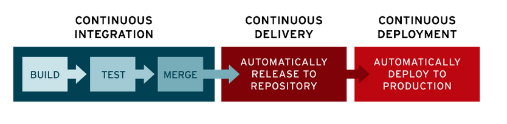
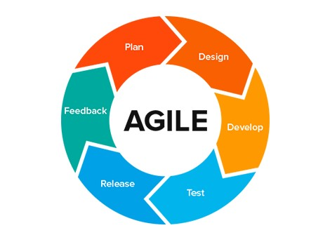
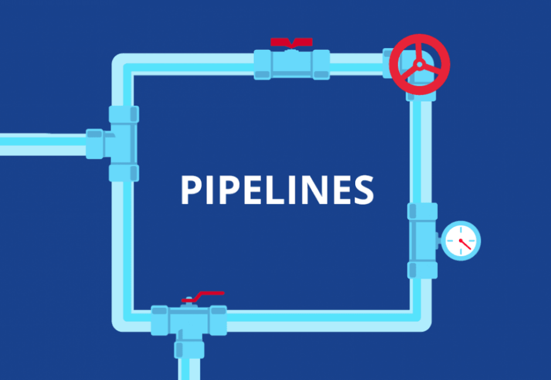
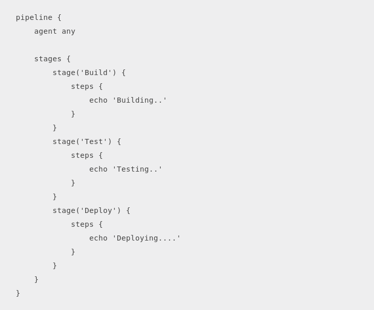
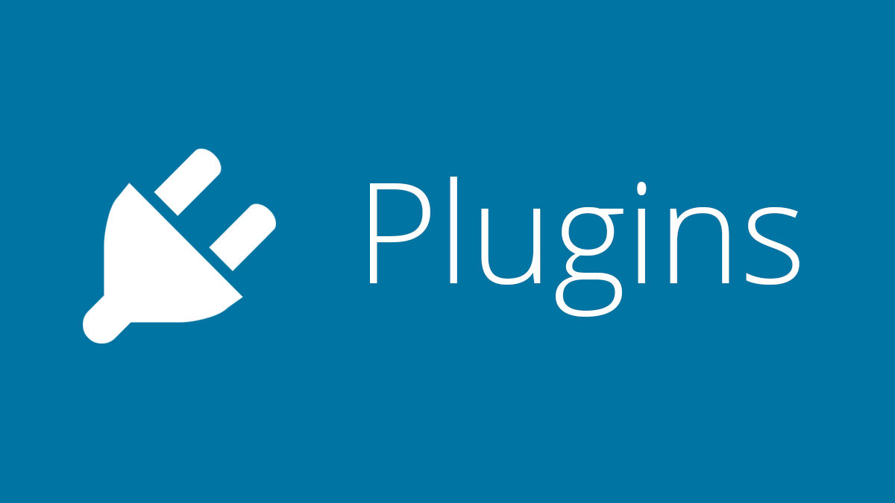
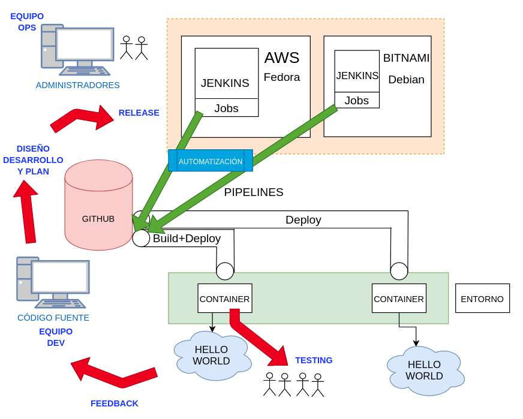

### CI/CD

+ Las siglas __CI/CD__ se refiere al término de _Continuous Integration / Continuous Deployment_.

+ La CI/CD es un método para distribuir aplicaciones a los clientes mediante el uso de la automatización en las etapas del desarrollo de aplicaciones:
    + Integración continua
    + Distribución continua
    + Implementación continua

### ETAPAS CI/CD

### EJEMPLOS
+ Jenkins
+ Gitlab  
+ TeamCity  
+ Travis CI
+ Buddy  
+ Puppet Enterprise  
+ ...

### METODOLOGÍA ÁGILE

### Ventajas

+ Adaptabilidad
+ Entrega rápida de software funcional
+ Flexibilidad para los desarrolladores
+ Promueve el trabajo en equipo y la capacitación

### JENKINS

### SOBRE JENKINS...

+ Desarrollado originalmente con el nombre Hudson (2004) en Sun Microsystems
+ Lanzamiento en 2011
+ Servidor open source de integración continua (CI)
+ Software de automatización más usado de todos
+ Escrito en Java
+ +14.000 plugins para soportar la automatización de todo tipo de tareas

### CARACTERÍSTICAS

+ Testar el software.
+ Revisar las métricas de calidad del software
+ Enviar las modificaciones del software
+ Automatizar la compilación del software o su despliegue
+ Notificar debidamente a los desarrolladores o al equipo de errores

### PIPELINES

+ Conjunto de prácticas para incorporar la automatización continua y el control permanente en todo el ciclo de vida.
+ Desde las etapas de integración y prueba, hasta las de distribución e implementación en el entorno elegido.  

  

### CARACTERÍSTICAS PIPELINES

+ Integración y verificación
+ Automatización
+ Cultura DevOps
+ Contenedores

### JOBS

+ La base de Jenkins son las tareas Jobs
+ Se indica todo el proceso hasta llegar a un build final estable.  
+ Cada integración se verifica compilando el código fuente
+ Se pasan las pruebas y métricas de calidad para detectar los errores
+ Sabemos el estado del software en todo momento

### JENKINSFILE

+ El pipeline del proyecto se declara en un fichero, se almacena y se versiona junto con el código en un fichero comúnmente llamado _Jenkinsfile_

###

### PLUGINS

+ Fragmento o componente de código hecho para ampliar las funciones de una herramienta o de un programa.  

    

+ Docker plugin
+ GitHub plugin
+ Blue Ocean plugin
+ Google Kubernetes Engine plugin

### INSFRAESTRUCTURA

+ Instancia [AWS AMAZON EDUCATE](https://github.com/isx46410800/M14_Jenkins/blob/master/aws_amazon.md)
+ AMI Fedora 29
+ IP pública elástica (http://18.209.188.35:9090/)
+ Bitnami Cloud con Jenkins-Debian (http://34.65.131.122:8080/)
+ Repositorio GitHub
+ Google Kubernetes Engine (GKE)

### INSTALACIÓN JENKINS

+ Es un servidor de automatización multiplataforma
+ [Descargar Jenkins](https://jenkins.io/download/)
+ [Instalación paso a paso](https://github.com/isx46410800/M14_Jenkins/blob/master/instalacion.md)
+ Previamente es necesario instalar _Java_
+ Navegador compatible

### CONFIGURACIÓN JENKINS

+ Entrar al navegador (http://18.209.188.35:9090/)
+ Configurar el admin inicial
+ Instalar plugins
+ Crear usuario administrador
+ [Configuración paso a paso](https://github.com/isx46410800/M14_Jenkins/blob/master/configuracion.md)

### ESQUEMA EJERCICIOS

### FIN
¡Gracias por vuestra asistencia!  
